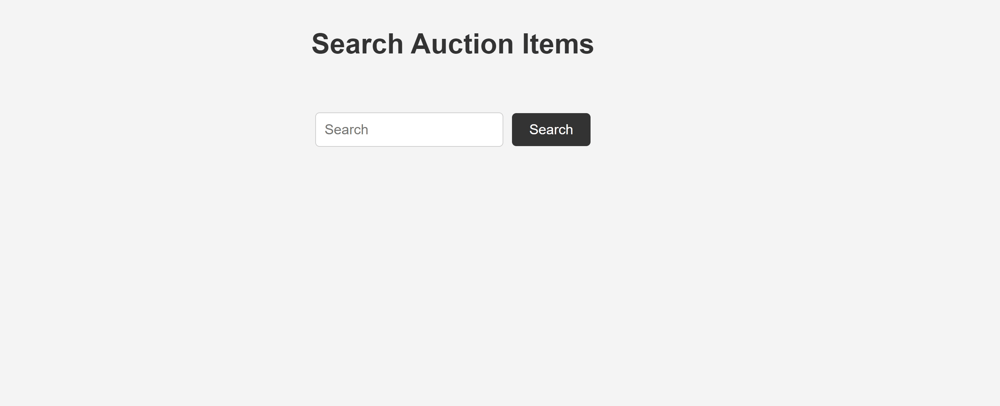

# Auction Items Search APIs


## Description

This application includes a simple UI for entering a search term. The search term is processed using OpenAI's generative AI to retrieve the most similar items from a local instance of a MongoDB database. Matching items are displayed to the user, and the user can click on an item for more detailed information.

An Auction items database can be created and seeded using the CLI tool located [here](https://github.com/nicolegunn/cli-mongodb-crud-and-seed.git).

## Features

- **Search Auction Items:** Users can search auction items by entering a search term.
- **Enhanced Search Capabilities:** Integration with OpenAI API to process search terms and retrieve the most similar items.
- **User-Friendly Interface:** Returns a list of similar items in a simple and intuitive user interface.
- **Detailed Item View:** Users can click on an item to view more detailed information.

## Demo
Here is a demo of the application in action:


## Technologies Used


## Prerequisites


- Node.js (v16 or later)
- npm (v8 or later)
- Local instance of MongoDB (v4.4 or later)

## Installation and Setup

1. Clone the repository:
   ```bash
   git clone https://github.com/nicolegunn/auction-items-search-apis.git
   cd auction-items-search-apis
2. Install dependencies:
   ```bash
   npm install
   ```
3. Set up environment variables:

   Create an .env file in the root directory and add your port number and OPENAI API key:

   ```env
   PORT=4000
   OPENAI_API_KEY=<Your API KEY>
   ```

4. Run the CLI tool:
   ```bash
   npm run dev
   ```

## License

This project is licensed under the MIT License. See the [LICENSE](LICENSE) file for more details.